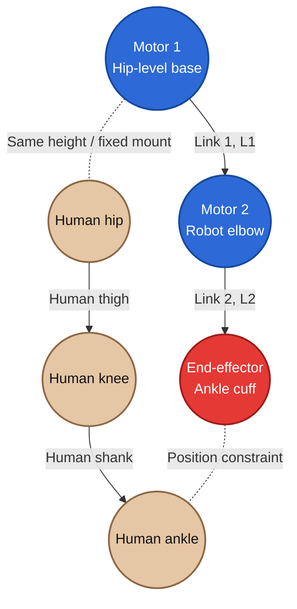

# End-effector 로봇팔형 개념도

## 1. 설계 개념

로봇팔형(`open_chain`)은 사람의 대퇴와 하퇴에 로봇 링크를 각각 고정하는 외골격형과 다르다. **사람의 무릎은 로봇 관절과 결합하지 않고**, 엉덩이 높이에 설치된 2자유도 직렬 로봇팔의 끝단만 발목 cuff에 연결한다. 로봇은 목표 보행에서 계산한 발목 위치를 따라가며 다리를 유도한다.

핵심 구성은 다음과 같다.

- Motor 1은 사람의 hip 높이에 고정된 로봇 base 관절이다.
- Link 1 끝의 Motor 2는 사람 무릎과 독립된 로봇 elbow 관절이다.
- Motor 2는 기본 설정에서 사람 무릎보다 뒤쪽(`-X`)에 놓이는 역기구학 해를 사용한다.
- Link 2 끝의 end-effector만 사람 발목에 위치 구속된다.
- 사람 hip/knee와 로봇 Motor 1/2 사이에는 관절각 구속이 없다.

## 2. 시상면 배치 개념도

아래 그림에서 실선은 각각 사람 다리와 로봇팔의 물리적 연결을, 점선은 end-effector와 사람 발목 사이의 위치 구속을 뜻한다.



실제 배치는 아래와 같이 Motor 2가 사람 무릎 뒤쪽에 위치한다. `+X`는 사람의 앞쪽, `+Z`는 위쪽이다.

```text
                           +Z (위)
                            ↑

             Motor 1 / base ●─────○ Human hip
                              ╲      ╲
                        Link 1 ╲      ╲ Human thigh
                                ● M2   ○ Human knee
                                 ╲       ╲
                           Link 2 ╲       ╲ Human shank
                                   ●======○ Human ankle
                                  EE   ankle cuff

          뒤쪽 (-X)  ←────────────────────────────→  앞쪽 (+X)
```

이 도식은 연결관계를 설명하기 위한 개념도이므로, 특정 보행 위상에서의 정확한 각도나 축척을 의미하지 않는다.

## 3. 구성요소와 구속조건

| 요소 | 역할 | 사람 다리와의 관계 |
|---|---|---|
| Motor 1 | 로봇 어깨에 해당하는 구동 관절 | 사람 hip 높이의 고정 base에 설치되지만 human hip joint와 각도 결합 없음 |
| Link 1 | Motor 1과 Motor 2를 연결 | 사람 대퇴와 독립적으로 움직임 |
| Motor 2 | 로봇 elbow에 해당하는 구동 관절 | 사람 무릎 뒤쪽에 위치하며 human knee joint와 결합하지 않음 |
| Link 2 | Motor 2와 end-effector를 연결 | 사람 하퇴와 독립적으로 움직임 |
| End-effector | 발목 궤적을 추종하는 로봇 끝단 | ankle cuff를 통해 사람 발목과 위치만 연결 |
| Human knee | 사람 다리의 무릎 관절 | 로봇 Motor 2와 독립적으로 회전 |

MuJoCo 모델에서는 발목 cuff의 두 site를 `connect` equality로 연결한다. 이 구속은 두 점의 위치를 일치시키지만 두 관절의 각도를 1:1로 묶지 않는다. 현재 구속 설정은 `solref="0.001 1"`, `solimp="0.99 0.999 0.0001 0.5 2"`이다.

따라서 이 구조는 로봇 자체로는 2자유도 open chain이지만, end-effector가 사람 발목에 연결된 전체 시뮬레이션 계는 사람 다리와 함께 폐루프를 이룬다. 여기서 **open chain이라는 이름은 로봇 링크 구조 자체**를 가리킨다.

## 4. 운동학

Motor 1 위치를 로봇 base \(B=(x_b,z_b)\), 목표 발목 위치를 \(P=(x_t,z_t)\)라 하면 다음과 같이 정의한다.

\[
d_x=x_t-x_b,\qquad d_z=z_t-z_b,\qquad r=\sqrt{d_x^2+d_z^2}
\]

링크 길이가 \(L_1\), \(L_2\)일 때 목표점이 도달 가능하려면 다음 조건을 만족해야 한다.

\[
|L_1-L_2|\le r\le L_1+L_2
\]

Motor 2의 상대각 \(q_2\)는 코사인 법칙으로 계산한다.

\[
\cos q_2=\frac{r^2-L_1^2-L_2^2}{2L_1L_2}
\]

현재 모델은 \(q_2=+\cos^{-1}(\cdot)\)인 해를 선택하여 Motor 2가 사람 무릎보다 뒤쪽에 놓이게 한다. Motor 1의 목표각은 다음과 같다.

\[
\alpha=\operatorname{atan2}(d_x,-d_z)
\]

\[
\beta=\operatorname{atan2}(L_2\sin q_2,\;L_1+L_2\cos q_2)
\]

\[
q_1=\alpha-\beta
\]

두 개의 역기구학 해 중 후방 elbow 해를 명시적으로 선택하는 설정은 `open_chain_elbow_behind=True`이다.

## 5. 실제 MuJoCo 시뮬레이션 이미지

아래 그림은 키 85.6 cm, 몸무게 12.0 kg인 만 2세 대표 체형에서 Link 1을 270 mm, Link 2를 193 mm로 설정해 수행한 실제 `open_chain` 시뮬레이션의 세 보행 위상이다. 총 링크 길이는 기존과 같은 463 mm이지만, proximal Link 1은 더 길고 distal Link 2는 더 짧다. 짙은 housing과 은색 flange는 Motor 1/2, 검정 구조 plate와 파란 보강판은 Robot Link 1/2, 베이지색 형상은 사람 다리, 빨간색 점은 발목 end-effector이다. 사람 다리는 여러 구형 요소를 연결하는 대신, 단면 굵기가 연속적으로 변하는 3D mesh로 대퇴 taper와 종아리 윤곽을 구현했다. 무릎에는 작은 patella 윤곽과 부드러운 연결부를 적용하고 발은 발목·뒤꿈치·발끝이 이어지는 별도 mesh로 표현했다. 모터와 링크의 두께 및 조립 구조가 보이도록 시상면에서 약 24° 회전한 사선 카메라를 사용했다.

이미지는 시뮬레이션 실행 후 로컬의
`outputs/exo_vs_end_effector_age2/robot_arm_simulation_anatomical.png`에서
확인할 수 있다. `outputs/`는 생성 결과이므로 GitHub 저장소에는 포함하지 않는다.

- Motor 1: 사람 hip 높이에 고정된 base actuator
- Motor 2: 사람 무릎과 결합하지 않고 무릎 뒤쪽에 배치되는 robot elbow
- End-effector: 사람 발목과 위치 구속되는 ankle cuff

시뮬레이션 영상은 로컬의
`outputs/exo_vs_end_effector_age2/robot_arm_anatomical_simulation.mp4`에 생성된다.

### EXO형 비교 이미지

아래 그림은 동일한 키와 몸무게 및 보행 위상에서 렌더링한 EXO형이다. Motor 1과 Motor 2가 각각 사람 hip과 knee 축에 정렬되고, 로봇 대퇴·하퇴 구조 링크와 cuff가 사람 다리를 따라 움직인다.

EXO형 비교 이미지는 로컬의
`outputs/exo_vs_end_effector_age2/exo_simulation_anatomical.png`에서 확인할 수 있다.

EXO형 영상은 로컬의
`outputs/exo_vs_end_effector_age2/exo_anatomical_simulation.mp4`에 생성된다.
